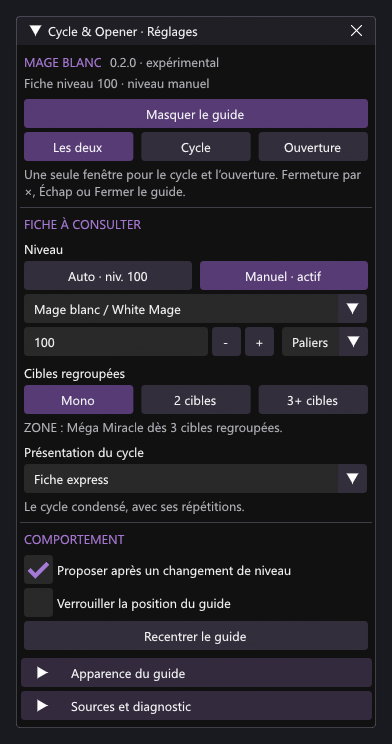

# Cycle & Opener


Cycles, priorités et ouvertures par niveau pour **Mage noir et Mage blanc**, du niveau 1 au 100. Mono et multi, avec le nombre minimal de cibles. Le cycle et l’ouverture partagent une seule fenêtre.


*Rendu ImGui hors jeu, avec Segoe UI. Ce n’est pas une capture FFXIV.*

**Auto** suit le job et le niveau synchronisé. **Manuel** permet de choisir le job et le niveau, avec saisie, boutons −/+ et paliers rapides. Une proposition facultative peut apparaître après un changement de niveau, une fois le chargement ou le combat terminé.

Les noms des sorts suivent la langue du client, notamment français et anglais. Les explications et l’interface restent en français. Les sources sont indiquées en petit sur les fiches.

Version expérimentale **0.2.0**, API Dalamud 15. Guide statique : aucun suivi du combat ni lancement de sort. Quêtes de classe et de job supposées terminées.

## Installation

Ajouter ce dépôt personnalisé dans les réglages de Dalamud :

```text
https://raw.githubusercontent.com/Aleqsd/dalamud-plugins/main/repo.json
```

Rechercher **Cycle & Opener** dans `/xlplugins`.

[Télécharger le ZIP 0.2.0](https://github.com/Aleqsd/cycle-opener/releases/download/v0.2.0/CycleOpener-0.2.0.zip) · [Notes de version](https://github.com/Aleqsd/cycle-opener/releases/tag/v0.2.0)

En développement, extraire le ZIP puis ajouter sa DLL aux **Dev Plugin Locations**. Désactiver cette copie avant l’installation depuis le dépôt ; garder une seule installation active.

## Utilisation

Ouvrir `/cycle`, puis **Ouvrir le guide**. Choisir **Les deux**, **Cycle** ou **Ouverture**. Les boutons **Mono**, **2 cibles** et **3+ cibles** changent la fiche. Cliquer sur une icône de l’ouverture pour lire son étape.

La fenêtre se ferme avec **×**, **Échap** ou **Fermer le guide**, même si les réglages sont fermés ou sa position verrouillée.



*Réglages ImGui hors jeu. Leur apparence reste fixe.*

- `/cycle show` et `/cycle hide` : afficher ou masquer le guide.
- `/cycle next` et `/cycle prev` : parcourir l’ouverture.
- Présentations du cycle : Fiche express, Frise, Priorités ou Deux sections.

L’intégration en jeu reste à tester. Ce dépôt personnalisé est distinct du catalogue officiel Dalamud.

[Sources des fiches](docs/RULES.md) · [Compilation et validation](docs/VALIDATION.md) · [Ressources et icône](docs/ASSETS.md)
