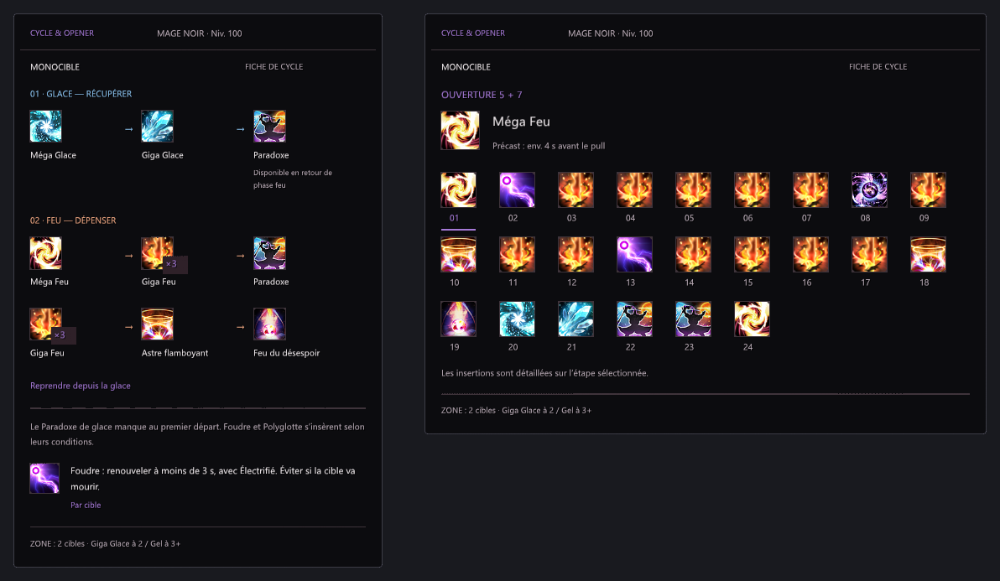

# Cycle & Opener


Des guides de cycles en français, par niveau : priorités mono/multicible et schémas d’ouverture. Premier job disponible : **Mage noir**. Garde l’ouverture à côté du cycle ou des priorités, dans deux panneaux déplaçables.



*Rendu des deux panneaux ImGui hors jeu, avec Segoe UI. Ce n’est pas une capture FFXIV.*

Le niveau du personnage adapte la fiche. Un changement de niveau peut proposer de l’ouvrir après le chargement et hors combat. Le nombre de cibles se choisit manuellement ; le seuil de zone apparaît sur la fiche.

Version expérimentale **0.1.1**, API Dalamud 15. Aucun suivi du combat ni lancement de sort. Les quêtes de job sont supposées terminées.

## Installation

Dans les réglages de Dalamud, ajouter ce dépôt personnalisé :

```text
https://raw.githubusercontent.com/Aleqsd/dalamud-plugins/main/repo.json
```

Rechercher ensuite **Cycle & Opener** dans `/xlplugins`.

[Télécharger le ZIP 0.1.1](https://github.com/Aleqsd/cycle-opener/releases/download/v0.1.1/CycleOpener-0.1.1.zip) · [Notes de version](https://github.com/Aleqsd/cycle-opener/releases/tag/v0.1.1)

Pour une installation de développement, extraire le ZIP puis ajouter sa DLL aux **Dev Plugin Locations**. Désactiver cette copie avant d’installer celle du dépôt ; garder une seule installation active.

## Utilisation

Ouvrir `/cycle`, puis activer le guide. **Fiche express + Ouverture** est la disposition par défaut. La barre du panneau permet de changer de vue et de choisir mono, 2 ou 3+ cibles. Cliquer sur une étape de l’ouverture pour lire ses insertions ; les deux panneaux partagent le niveau et les cibles.

- `/cycle show` et `/cycle hide` : afficher ou masquer.
- `/cycle next` et `/cycle prev` : parcourir l’ouverture.
- Dans les réglages : niveau manuel, popup, verrouillage et recentrage.

Les cinq directions sont **Fiche express**, **Frise**, **Priorités**, **Deux phases** et **Ouverture**. Ouvrir `preview/index.html` après génération des rendus pour les comparer.

L’intégration en jeu reste à tester. Ce dépôt personnalisé est distinct du catalogue officiel Dalamud.

[Sources des fiches](docs/RULES.md) · [Compilation et validation](docs/VALIDATION.md) · [Ressources et icône](docs/ASSETS.md)
